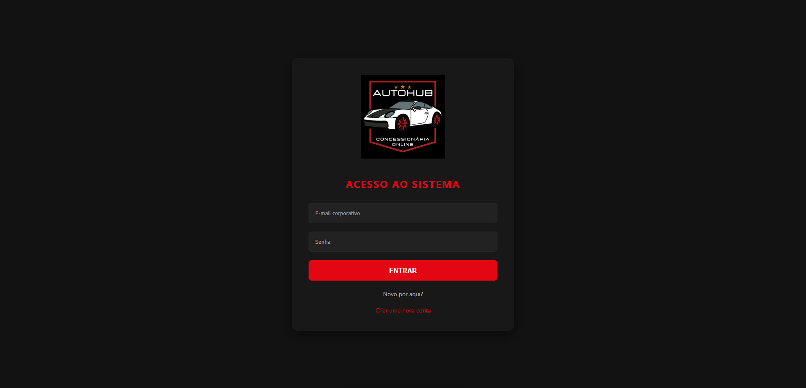
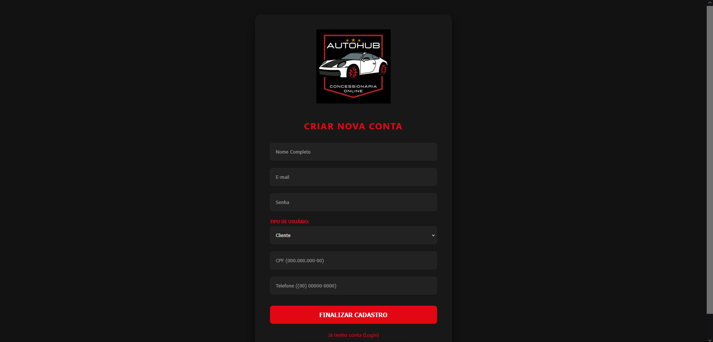
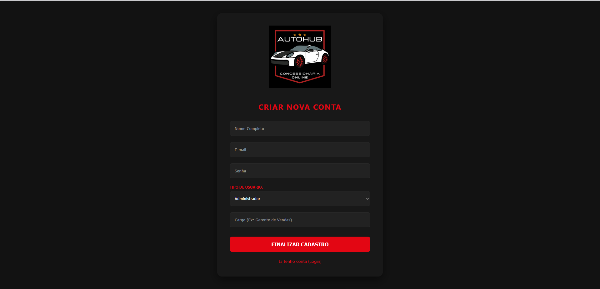
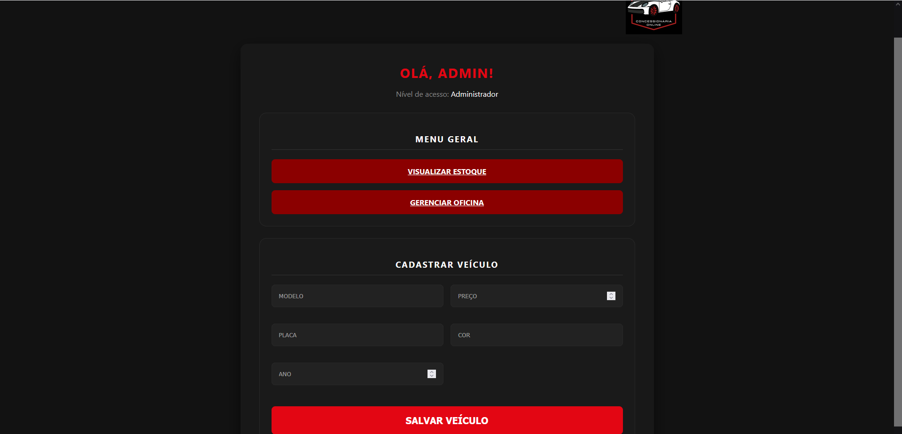
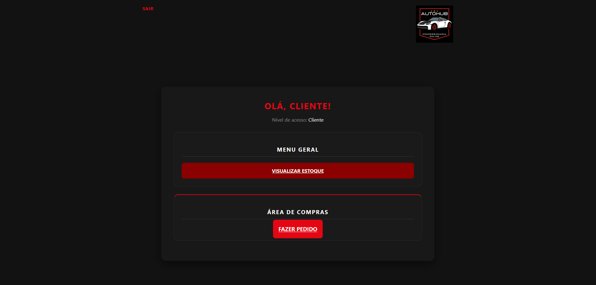
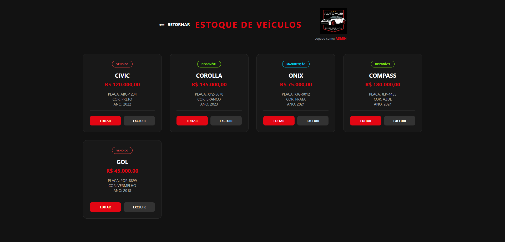
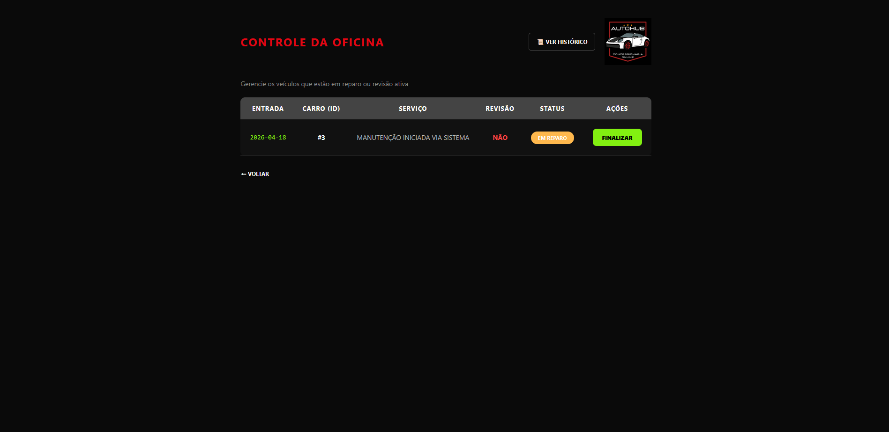
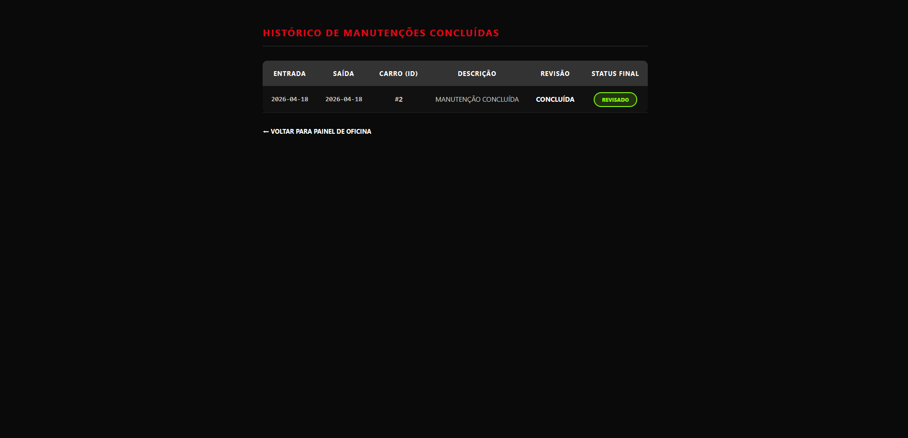
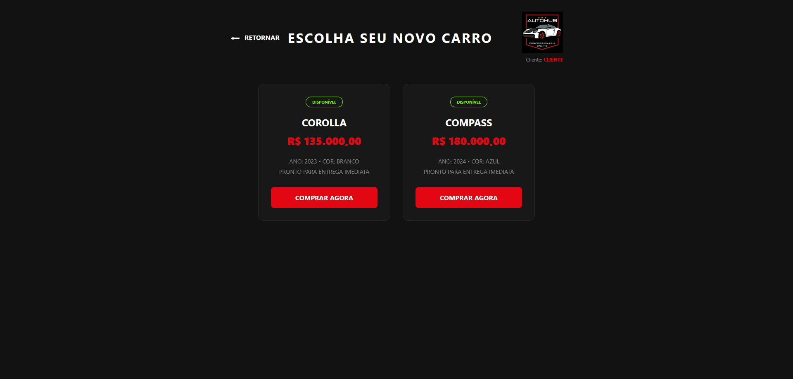

# AutoHub — Concessionária Online

> Sistema web completo de gerenciamento de concessionária com controle de estoque, vendas, oficina e autenticação por níveis de acesso — desenvolvido em Java puro com Servlets, JSP e arquitetura MVC.


---

## 📸 Preview

| Login | Cadastro Cliente | Cadastro Admin |
|-------|-----------------|----------------|
|  |  |  |

| Dashboard Admin | Dashboard Cliente | Estoque |
|----------------|-------------------|---------|
|  |  |  |

| Controle de Oficina | Histórico | Área de Compras |
|--------------------|-----------|----------------|
|  |  |  |

---

## 📋 Sobre o Projeto

O **AutoHub** é uma aplicação web de gerenciamento para concessionárias desenvolvida com **Java puro** (sem frameworks), cobrindo o ciclo completo de um sistema real: autenticação com controle de sessão, dois perfis de usuário com dashboards distintos, CRUD de veículos, fluxo de compra para clientes e gerenciamento de oficina com histórico de manutenções.

---

## ✨ Funcionalidades

### 👤 Autenticação e Controle de Acesso
- Login com e-mail e senha
- Cadastro de novos usuários com campos distintos por perfil: CPF e telefone para Cliente, cargo para Administrador
- Dois perfis: **Administrador** e **Cliente**
- **Dashboards distintos** — cada perfil vê apenas o que lhe compete
- Proteção de rotas no servidor — redirecionamento automático por nível de acesso

### 🚗 Gestão de Estoque — Administrador
- Cadastro de veículos com modelo, preço, placa, cor e ano
- Listagem em cards com **status dinâmico**: `Disponível` · `Vendido` · `Manutenção`
- Edição e exclusão de veículos

### 🔧 Controle de Oficina — Administrador
- Tabela de veículos em reparo ativo com entrada, serviço, revisão e status
- Botão **Finalizar** para encerrar a manutenção e atualizar o status do veículo
- **Ver Histórico** — lista completa de manutenções concluídas com data de saída e status final

### 🛒 Área de Compras — Cliente
- Dashboard com acesso a **Visualizar Estoque** e **Fazer Pedido**
- Catálogo de veículos disponíveis com preço, ano, cor e status
- Botão **Comprar Agora** para registrar o pedido diretamente

---

## 🏗️ Arquitetura MVC + Command Pattern

```
AutoHub/
│
├── WebContent/                         # Camada View
│   ├── index.html
│   ├── login.html
│   ├── cadastro_usuario.html
│   ├── dashboard.jsp
│   ├── lista_carros.jsp
│   ├── comprar_carro.jsp
│   ├── editar_carro.jsp
│   ├── gerenciar_oficina.jsp
│   ├── historico_manutencao.jsp
│   ├── registrar_manutencao.jsp
│   └── WEB-INF/
│
└── src/
    │
    ├── command/                        # Command Pattern — uma classe por ação
    │   ├── Command.java                  (interface)
    │   ├── LoginCommand.java
    │   ├── SalvarCarroCommand.java
    │   ├── AtualizarCarroCommand.java
    │   ├── ExcluirCarroCommand.java
    │   ├── ListarCarrosCommand.java
    │   ├── PedidoCommand.java
    │   ├── RegistrarManutencaoCommand.java
    │   └── FinalizarManutencaoCommand.java
    │
    ├── controller/                     # Servlets — roteamento HTTP
    │   ├── CarroController.java
    │   ├── LoginController.java
    │   ├── ManutencaoController.java
    │   ├── PedidoController.java
    │   └── UsuarioController.java
    │
    ├── dao/                            # Acesso ao banco de dados (JDBC)
    │   ├── CarroDAO.java
    │   ├── ManutencaoDAO.java
    │   ├── PedidoDAO.java
    │   └── UsuarioDAO.java
    │
    ├── model/                          # Entidades do sistema
    │   ├── Usuario.java
    │   ├── Administrador.java
    │   ├── Cliente.java
    │   ├── Carro.java
    │   ├── Manutencao.java
    │   └── Pedido.java
    │
    └── util/
        └── DatabaseConnection.java     # Gerenciador de conexão com MySQL
```

### Fluxo de uma Requisição

```
[Navegador]
     │
     ▼
[Controller — Servlet]    ←── valida sessão e nível de acesso
     │
     ▼
[Command]                 ←── executa a ação de negócio isolada
     │
     ▼
[DAO + JDBC]              ←── consulta ou persiste no MySQL
     │
     ▼
[JSP — View]              ←── renderiza a resposta ao usuário
```

| Camada | Tecnologia | Responsabilidade |
|--------|-----------|-----------------|
| **View** | JSP / HTML | Interface renderizada no servidor |
| **Controller** | Java Servlets | Recepção, validação de sessão e roteamento HTTP |
| **Command** | Java — interface `Command` | Encapsulamento de cada ação de negócio |
| **DAO** | Java + JDBC | Operações de leitura e escrita no banco |
| **Model** | POJOs Java | Representação das entidades do domínio |
| **Util** | `DatabaseConnection` | Gerenciamento da conexão MySQL |

---

## 🛠️ Tecnologias e Bibliotecas

| Tecnologia | Versão | Uso |
|-----------|--------|-----|
| **Java** | JDK 25 | Linguagem principal |
| **Jakarta Servlets** | 9.0 | Controladores HTTP |
| **JSP** | Jakarta EE | Views dinâmicas no servidor |
| **JDBC** | — | Acesso ao banco de dados |
| **MySQL Connector/J** | 9.6.0 | Driver de conexão com MySQL |
| **MySQL** | 8.0 | Banco de dados relacional |
| **Apache Tomcat / TomEE** | — | Servidor de aplicação |
| **HTML / CSS** | — | Interface dark theme personalizada |

---

## ⚙️ Pré-requisitos

- [JDK 11+](https://www.oracle.com/java/technologies/downloads/)
- [Apache Tomcat 10+](https://tomcat.apache.org/download-10.cgi)
- [MySQL 8.0+](https://dev.mysql.com/downloads/)
- [Eclipse IDE for Enterprise Java Developers](https://www.eclipse.org/downloads/)

---

## 🚀 Como Executar

### 1. Clone o repositório

```bash
git clone https://github.com/GKeller03/AutoHub-Concessionaria-CRUD-Web.git
cd AutoHub-Concessionaria-CRUD-Web
```

### 2. Configure o banco de dados

Execute o script abaixo no MySQL Workbench ou via terminal:

```sql
CREATE DATABASE autohub;
USE autohub;

CREATE TABLE usuario (
    id INT AUTO_INCREMENT PRIMARY KEY,
    nome VARCHAR(100) NOT NULL,
    email VARCHAR(100) UNIQUE NOT NULL,
    senha VARCHAR(255) NOT NULL,
    tipo_usuario ENUM('Administrador', 'Cliente') NOT NULL
);

CREATE TABLE carro (
    id INT AUTO_INCREMENT PRIMARY KEY,
    modelo VARCHAR(100) NOT NULL,
    placa VARCHAR(10) UNIQUE NOT NULL,
    cor VARCHAR(30),
    ano INT,
    preco DECIMAL(10,2),
    status ENUM('Disponível', 'Vendido', 'Manutenção') DEFAULT 'Disponível'
);

CREATE TABLE pedido (
    id INT AUTO_INCREMENT PRIMARY KEY,
    id_usuario INT NOT NULL,
    id_carro INT NOT NULL,
    data_pedido DATE NOT NULL,
    FOREIGN KEY (id_usuario) REFERENCES usuario(id),
    FOREIGN KEY (id_carro) REFERENCES carro(id)
);

CREATE TABLE manutencao (
    id INT AUTO_INCREMENT PRIMARY KEY,
    id_carro INT NOT NULL,
    descricao TEXT,
    data_entrada DATE NOT NULL,
    data_saida DATE,
    em_revisao BOOLEAN DEFAULT TRUE,
    status_final VARCHAR(50),
    FOREIGN KEY (id_carro) REFERENCES carro(id)
);

INSERT INTO usuario (nome, email, senha, tipo_usuario)
VALUES ('Admin', 'admin@autohub.com', 'admin123', 'Administrador');

INSERT INTO usuario (nome, email, senha, tipo_usuario)
VALUES ('Cliente Teste', 'cliente@autohub.com', 'cliente123', 'Cliente');
```

### 3. Configure a conexão com o banco

Edite o arquivo `src/util/DatabaseConnection.java`:

```java
private static final String URL = "jdbc:mysql://localhost:3306/autohub";
private static final String USER = "root";
private static final String PASSWORD = "sua_senha";
```

### 4. Importe e execute no Eclipse

1. `File > Import > Existing Projects into Workspace`
2. Selecione a pasta do projeto clonado
3. Confirme que o **Apache Tomcat** está configurado em `Window > Preferences > Server`
4. Clique com o botão direito no projeto → `Run As > Run on Server`
5. Acesse: `http://localhost:8080/autohub`

### Credenciais padrão para teste

| Perfil | E-mail | Senha |
|--------|--------|-------|
| Administrador | admin@autohub.com | admin123 |
| Cliente | cliente@autohub.com | cliente123 |

---

## 📊 Modelo de Dados

```
┌──────────────────┐          ┌───────────────────┐
│     USUARIO      │          │       CARRO        │
├──────────────────┤          ├───────────────────┤
│ id (PK)          │          │ id (PK)            │
│ nome             │          │ modelo             │
│ email            │          │ placa              │
│ senha            │          │ cor                │
│ tipo_usuario     │          │ ano                │
└────────┬─────────┘          │ preco              │
         │                    │ status             │
         │              ┌─────┴──────┐   ┌─────────┴──────────┐
         │              │   PEDIDO   │   │    MANUTENCAO       │
         │              ├────────────┤   ├────────────────────┤
         └──────────────┤id_usuario  │   │ id_carro (FK)       │
                        │id_carro    │   │ descricao           │
                        │data_pedido │   │ data_entrada        │
                        └────────────┘   │ data_saida          │
                                         │ em_revisao          │
                                         │ status_final        │
                                         └────────────────────┘
```

---

## 🧠 O que Este Projeto Demonstra

- Desenvolvimento web back-end com **Java puro**, sem Spring ou outros frameworks
- Padrão **MVC** com separação real entre Controller, Model e View
- **Command Pattern** com interface `Command` — cada ação de negócio em sua própria classe
- **Herança em OOP** — `Administrador` e `Cliente` herdam de `Usuario`
- **Autenticação com HttpSession** e controle de acesso por perfil
- **Dashboards distintos** renderizados condicionalmente pelo mesmo JSP
- Operações **CRUD completas** com JDBC e MySQL
- **Proteção de rotas no servidor** — validação de sessão nos Servlets
- Gerenciamento de **estado de entidades** — status do veículo alterado por ações do sistema
- Fluxos de negócio reais: **compra pelo cliente** e **ciclo de manutenção pelo admin**
- Interface **dark theme** construída do zero com HTML/CSS puro

---

## 🔮 Possíveis Melhorias Futuras

- [ ] Hash de senha com BCrypt
- [ ] Paginação e filtros no estoque
- [ ] Confirmação de pedido com e-mail automático
- [ ] Relatórios de vendas e manutenções em PDF
- [ ] API REST com retorno JSON
- [ ] Migração para Spring Boot + Spring Security + Hibernate
- [ ] Testes unitários com JUnit e Mockito
- [ ] Deploy em nuvem (Railway / Render)

---

## 👨‍💻 Autor

**Gabriel Keller**
- LinkedIn: [linkedin.com/in/gabriel-keller-a2a575354](https://www.linkedin.com/in/-gabriel-keller/)
- GitHub: [@GKeller03](https://github.com/GKeller03)
- Email: gabrielkeller03052005@gmail.com

---

## 📄 Licença

Este projeto está sob a licença MIT. Consulte o arquivo [LICENSE](LICENSE) para mais detalhes.

---

<p align="center">
  <b>AutoHub</b> — desenvolvido como projeto de portfólio para demonstrar habilidades em Java Web, MVC e desenvolvimento back-end.
</p>
